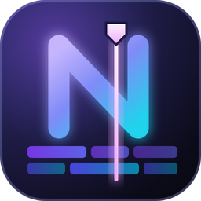

<p align="center"></p>

# Notion Companion for Editors

Panneau pour **DaVinci Resolve Studio** et **Adobe Premiere Pro** qui associe une page Notion à chaque projet de montage et l'affiche automatiquement.

```
Projet A  →  Page Notion A
Projet B  →  Page Notion B
```

L'association se fait une fois. Ensuite, quand vous changez de projet dans le logiciel, le panneau charge la page correspondante.

| | DaVinci Resolve Studio | Premiere Pro |
|---|---|---|
| Type de plugin | Workflow Integration (Electron fourni avec Resolve) | Panneau UXP |
| Intégration | Fenêtre séparée (ou mode ancré au bord de l'écran) | **Vrai panneau ancrable** dans l'interface |
| Détection du projet | Interrogation légère toutes les 1,5 s | Événements Premiere + vérification toutes les 2 s |
| Identifiant du projet | `Project.GetUniqueId()` | `Project.guid` |
| Versions | Studio 20.1+ (testé 21.1) | 25.6+ (testé 26.5.1) |
| Systèmes | macOS, Windows | macOS, Windows |

- **API Notion officielle** (`Notion-Version: 2026-03-11`) avec un Personal Access Token.
- **Rendu propre au plugin** (pas d'iframe), avec cache local et mode hors ligne.
- **Aucune dépendance npm**, rien à compiler pour l'utilisateur.

> **État actuel** : voir [docs/STATUS.md](docs/STATUS.md) pour ce qui a été vérifié, ce qui reste à tester et les points d'interface à revoir.

---

## Sommaire

1. [Installation](#1-installation)
2. [Token Notion](#2-créer-le-personal-access-token-notion)
3. [Utilisation](#3-utilisation)
4. [Identification des projets](#4-identification-des-projets)
5. [Données locales et sécurité](#5-données-locales-et-sécurité)
6. [Architecture](#6-architecture)
7. [Développement, tests et debug](#7-développement-tests-et-debug)
8. [Désinstallation](#8-désinstallation)
9. [Publier une version](#9-publier-une-version)
10. [Limitations connues](#10-limitations-connues)
11. [Pistes futures](#11-pistes-futures)
12. [Licence](#12-licence)

---

## 1. Installation

Téléchargez la dernière version depuis la page **Releases** du dépôt :

| Fichier | Contenu |
|---|---|
| `NotionCompanionForEditors-<version>-macOS.zip` | Installeurs Resolve + Premiere pour macOS. |
| `NotionCompanionForEditors-<version>-Windows.zip` | Installeurs Resolve + Premiere pour Windows. |
| `NotionCompanionForEditors-<version>_premierepro.ccx` | Panneau Premiere seul (macOS et Windows). |

Décompressez l'archive (Windows : clic droit → **Extraire tout**). Elle contient :

```
Installer pour DaVinci Resolve   .command (macOS) / .cmd (Windows)
Installer pour Premiere Pro
Desinstaller de DaVinci Resolve
Desinstaller de Premiere Pro
resolve/plugin/        plugin Resolve prêt à installer
premiere/*.ccx         panneau Premiere
scripts/               scripts utilisés par les installeurs
```

- **macOS** : la première fois, faites **clic droit → Ouvrir** sur un fichier `.command` (macOS bloque le double-clic sur un script téléchargé).
- **Windows** : double-clic sur le `.cmd`, puis acceptez la demande administrateur. Si SmartScreen s'affiche : *Informations complémentaires → Exécuter quand même*.

### DaVinci Resolve Studio

`Installer pour DaVinci Resolve` copie le plugin dans :

| Système | Dossier |
|---|---|
| macOS | `/Library/Application Support/Blackmagic Design/DaVinci Resolve/Workflow Integration Plugins/com.saparenprod.notioncompanion/` |
| Windows | `%PROGRAMDATA%\Blackmagic Design\DaVinci Resolve\Support\Workflow Integration Plugins\com.saparenprod.notioncompanion\` |

Il y ajoute le module `WorkflowIntegration.node` de Blackmagic, copié depuis **votre** installation de Resolve (dossier `Developer`). Ce module n'est pas redistribué dans ce dépôt.

**Redémarrez Resolve**, puis ouvrez **Workspace (Espace de travail) → Workflow Integrations → Notion Companion for Editors**.

La version gratuite de Resolve ne prend pas en charge les Workflow Integrations.

### Premiere Pro

Au choix :

- **Double-clic sur le fichier `.ccx`** : Creative Cloud l'installe, après un avertissement pour les plugins hors Marketplace.
- **`Installer pour Premiere Pro`** : utilise l'installeur officiel d'Adobe (Unified Plugin Installer Agent), fourni avec Creative Cloud.

Relancez ensuite Premiere, puis ouvrez **Fenêtre → Plug-ins UXP → Notion Companion for Editors**. Ancrez le panneau où vous voulez : Premiere s'en souvient dans votre espace de travail.

## 2. Créer le Personal Access Token Notion

1. Dans Notion : **Paramètres → Developer → Enable developer features**.
2. Dans la section **Developer** de la barre latérale : **Personal access tokens → New token**.
3. Donnez-lui un nom, cochez la capacité **Notion API** et choisissez une expiration (7 jours à 1 an).
4. Cliquez sur **Create token** et copiez-le : il ne sera plus affiché.

Documentation officielle : <https://developers.notion.com/guides/get-started/personal-access-tokens>

Un Personal Access Token **agit en votre nom** : il voit toutes les pages auxquelles vous avez accès dans ce workspace, **sans partage supplémentaire**.

> Un token d'**intégration interne** fonctionne aussi. Dans ce cas, chaque page (ou page parente) doit être partagée avec l'intégration : **••• → Connexions**.

Resolve et Premiere gardent chacun leur propre copie du token. Saisissez-le une fois dans chaque panneau. Vous pouvez utiliser le même token pour les deux.

## 3. Utilisation

1. Ouvrez un projet, puis le panneau.
2. Premier lancement : **⚙ → coller le token → Enregistrer et tester**.
3. **Associer une page Notion** :
   - tapez quelques lettres, ou laissez vide pour voir les pages récentes ;
   - le parent de chaque page est affiché, pour distinguer les homonymes ;
   - vous pouvez aussi **coller le lien** d'une page ;
   - flèches et Entrée au clavier.
4. La page s'affiche. L'association est enregistrée immédiatement. Elle est rechargée automatiquement à chaque retour sur ce projet.

| Élément | Rôle |
|---|---|
| En-tête | Projet, timeline ou séquence active, état de Notion (pastille). |
| ↻ | Revérifie le projet et recharge la page depuis Notion. |
| Ouvrir dans Notion | Ouvre la page dans l'app Notion si elle est disponible, sinon dans le navigateur (réglable). |
| ••• | Changer de page, Dissocier. |
| « Cache · il y a 5 min » | Le contenu vient du cache local (hors ligne, ou actualisation en cours). |
| Ancrer / Épingle (Resolve) | Colle la fenêtre au bord de l'écran, pleine hauteur, ou la garde au premier plan. |

Quand le panneau reprend le focus, il vérifie au plus une fois par minute si la page a changé dans Notion, et la recharge si c'est le cas.

**Paramètres** :

- **Notion** : tester, modifier ou supprimer le token.
- **Associations** : voir le nombre de projets liés ; **Gérer les associations** pour changer la page ou supprimer une association.
- **Logiciel** : version, méthode d'identification des projets.
- **Affichage** : ouverture des liens ; ancrage et premier plan pour Resolve.
- **Cache** : taille, vider.
- **À propos** : versions, dossier des données.

**Blocs Notion affichés** :

- **Texte** : paragraphes, titres 1 à 4 (y compris dépliables), listes à puces et numérotées imbriquées, to-do, citations, callouts, séparateurs, code, équations (texte brut), toggles.
- **Structure** : tableaux, colonnes, blocs synchronisés.
- **Médias** : images ; fichiers, PDF, vidéos, signets et embeds sous forme de liens.
- **Autres pages** : sous-pages et bases de données, en liens vers Notion.
- **Mise en forme** : gras, italique, barré, souligné, code, couleurs, liens, mentions.

Un bloc non supporté affiche un encart « ouvrir dans Notion », sans erreur. Les enfants sont chargés récursivement, avec pagination, de façon progressive. L'affichage est tronqué au-delà de 3000 blocs ou 8 niveaux.

## 4. Identification des projets

Seules des méthodes documentées sont utilisées. Leur présence est vérifiée à l'exécution.

**DaVinci Resolve** (`Developer/Scripting/DaVinciResolveScript.pyi`, Resolve 21.1) :

- Identifiant principal : `Project.GetUniqueId()`.
- Repli : type + nom de la base, plus le nom du projet.
- Resolve n'expose aucun événement de changement de projet aux Workflow Integrations. Le panneau interroge donc `GetCurrentProject()` toutes les 1,5 s.

**Premiere Pro** (API UXP publique, [référence](https://developer.adobe.com/premiere-pro/uxp/ppro-reference/)) :

- Identifiant principal : `Project.guid`, stable d'une session à l'autre d'après les tests sur Premiere 26.5.1.
- Repli : le chemin du fichier `.prproj`.
- Détection par `EventManager.addGlobalEventListener(ProjectEvent.OPENED / ACTIVATED / CLOSED)`, plus une vérification toutes les 2 s : le passage entre deux projets déjà ouverts ne déclenche pas toujours d'événement.

**Règles de correspondance** (`core/storage/associations.js`) :

1. **Même identifiant** : correspondance. Le nom et l'emplacement sont mis à jour, donc les renommages sont suivis.
2. **Premiere, même fichier `.prproj`** mais nouvel identifiant : correspondance, et l'association est réaffectée au nouvel identifiant.
3. **Resolve, un côté sans identifiant**, même base et même nom : correspondance.
4. **Même nom** mais autre identifiant ou autre fichier (copie, réimport, homonyme) : le panneau **propose** l'ancienne page (« Utiliser cette page »), sans décider à votre place.

## 5. Données locales et sécurité

| | Resolve | Premiere |
|---|---|---|
| Données | macOS `~/Library/Application Support/Notion Companion/`<br>Windows `%APPDATA%\Notion Companion\` | Dossier de données du plugin géré par Premiere :<br>macOS `~/Library/Application Support/Adobe/UXP/PluginsStorage/PPRO/<version>/External/com.saparenprod.notioncompanion/PluginData/`<br>Windows `%APPDATA%\Adobe\UXP\PluginsStorage\PPRO\<version>\External\com.saparenprod.notioncompanion\PluginData\` |
| Token | `safeStorage` d'Electron : Trousseau macOS / DPAPI Windows | `secureStorage` d'UXP (stockage sécurisé du système) |

Fichiers :

- `associations.json` : associations projet → page, versionnées avec migrations. Les associations de la v0.1 sont migrées automatiquement.
- `settings.json` : réglages du panneau.
- `cache/<pageId>.json` : cache des pages (sous Premiere : `cache__<pageId>.json`).
- `logs/companion.log` : journal développeur (sous Premiere : `logs__companion.log`).

Exemple d'association :

```json
{
  "schemaVersion": 2,
  "associations": {
    "uid:a1b2c3d4-…": {
      "host": "resolve",
      "projectUid": "a1b2c3d4-…",
      "projectName": "Mon documentaire",
      "location": { "key": "Disk|Local Database", "label": "Local Database · Documentaires" },
      "notionPageId": "…",
      "notionPageTitle": "Mon documentaire",
      "notionPageUrl": "https://www.notion.so/…",
      "notionPageIcon": { "type": "emoji", "emoji": "🎬" }
    }
  }
}
```

**Sécurité** :

- **Token** : il n'est jamais écrit en clair, jamais dans le code ni le dépôt, et jamais transmis à l'interface (qui ne reçoit qu'un état). Les journaux masquent le token enregistré, ainsi que tout motif `ntn_…`, `secret_…` ou `Bearer …`. Si le stockage sécurisé du système est indisponible, le token n'est pas enregistré.
- **Resolve (Electron)** : `contextIsolation`, `sandbox` et `nodeIntegration: false`. L'API est limitée à `preload.js`, l'expéditeur de chaque appel IPC est vérifié. La Content-Security-Policy est stricte : scripts locaux uniquement, aucun `connect-src`. Navigation et popups sont bloquées, toutes les permissions web sont refusées.
- **Premiere (UXP)** : les permissions sont déclarées dans `manifest.json` : réseau, ouverture de liens `https`, `http`, `mailto` et `notion`, stockage local au plugin.
- **Arguments** : toutes les opérations appelées par l'interface valident leurs arguments (`core/operations.js`). Seuls les liens `https`, `http` et `mailto` sont ouverts. Le contenu Notion est inséré uniquement comme texte (jamais `innerHTML`).

## 6. Architecture

```
core/                 code commun (JavaScript CommonJS, sans dépendance)
  controller.js       projet actif → association → contenu Notion
  operations.js       opérations appelables par l'interface (validation)
  identity.js         identification des projets (Resolve / Premiere)
  notion/             client HTTP (3 req/s, retries, Retry-After), recherche, blocs, chargement récursif
  storage/            JSON versionné + migrations, associations, cache, token, réglages
  ui/                 interface commune (DOM compatible Chromium et UXP) + styles.css
hosts/
  resolve/            Workflow Integration : manifest.xml, main.js, preload.js, host/ (bridge Resolve,
                      surveillance du projet, IPC, fenêtre, ancrage, stockage fichiers, safeStorage)
  premiere/           Panneau UXP : manifest.json, index.html, host/ (surveillance Premiere,
                      stockage UXP, secureStorage)
assets/icon.svg       icône (source vectorielle)
docs/STATUS.md        état des tests et points ouverts
scripts/              build, bundle, packaging, installeurs macOS (.sh) et Windows (.ps1), tests
tests/                tests unitaires (exécutés par Electron)
tools/render-icons/   rendu de l'icône SVG en PNG
```

`scripts/build.sh` assemble les deux plugins dans `build/`. `scripts/bundle.py`, un petit bundler sans dépendance, regroupe l'interface en un seul script, car UXP ne charge pas les modules ES. Pour Resolve, le code commun est livré dans `node_modules/core`.

## 7. Développement, tests et debug

Prérequis : `bash` et `python3`. Pour les tests et le lancement hors logiciel : l'Electron fourni avec Resolve (macOS). **Node.js n'est pas nécessaire.**

```bash
./scripts/build.sh      # build/resolve + build/premiere
./scripts/test.sh       # build puis tests unitaires
./scripts/package.sh    # archives de release dans dist/
./scripts/install.sh    # installe le plugin Resolve construit
./scripts/premiere-install.sh dist/NotionCompanionForEditors-<version>_premierepro.ccx
```

**Journaux** : voir les dossiers de données (§5). Aucun token n'y figure. Exemple :

```bash
tail -f ~/Library/Application\ Support/Notion\ Companion/logs/companion.log
```

**Resolve** :

- DevTools : menu **Affichage → Outils de développement** (`⌥⌘I` / `Ctrl+Shift+I`).
- Hors de Resolve : `NOTION_COMPANION_DEVTOOLS=1 ./scripts/dev-run.sh` affiche « DaVinci Resolve inaccessible » ; rien n'est simulé.
- `NOTION_COMPANION_USER_DATA=/chemin` permet d'utiliser un autre dossier de données.

**Premiere** : installez **UXP Developer Tools** depuis Creative Cloud, activez **Paramètres → Plug-ins → Activer le mode développeur** dans Premiere, puis **Load** sur `build/premiere/manifest.json` pour obtenir la console et le rechargement à chaud.

**Icône** : `assets/icon.svg`, rendue en PNG avec `./scripts/render-icons.sh`.

**Problèmes fréquents**

| Symptôme | Solution |
|---|---|
| Absent du menu Resolve | Redémarrer Resolve ; la version Studio est requise ; relancer l'installeur. |
| « Module WorkflowIntegration.node introuvable » | Relancer l'installeur Resolve. |
| Absent du menu Premiere | Relancer Premiere ; vérifier l'installation dans **Creative Cloud → Plug-ins**. |
| Installation `.ccx` refusée (`status = -267`) | Manifeste non conforme à l'installeur Creative Cloud (par exemple `host` sous forme de tableau). Le build produit la bonne forme. |
| Token refusé | Token incomplet, expiré, ou capacité « Notion API » non cochée. |
| Page absente de la recherche | Avec un token d'intégration, partager la page avec l'intégration. |
| Image « lien expiré » | Les fichiers hébergés par Notion expirent après environ 1 h : ↻ Actualiser. |

## 8. Désinstallation

- **Resolve** : `Desinstaller de DaVinci Resolve` retire le plugin et conserve les données. Pour tout supprimer :
  - macOS : `./scripts/uninstall.sh --purge`
  - Windows : `uninstall.ps1 -Purge`

  Redémarrez ensuite Resolve.
- **Premiere** : `Desinstaller de Premiere Pro`, ou **Creative Cloud → Plug-ins → Gérer les plug-ins**. Pour effacer aussi les données, supprimez le dossier `PluginData` indiqué au §5.
- **Notion** : révoquez le token dans **Developer → Personal access tokens** si vous ne l'utilisez plus.

## 9. Publier une version

1. Changez `PLUGIN_VERSION` dans `core/constants.js` : c'est la seule source, recopiée dans tous les manifestes au build. Une version comme `0.3.0-beta.1` est publiée en **pré-release** (les manifestes reçoivent `0.3.0`).
2. Ajoutez une section `## x.y.z` dans `CHANGELOG.md`.
3. Commitez, puis poussez un tag : `git tag v0.3.0 && git push origin v0.3.0`.

Le workflow GitHub Actions construit alors les archives macOS et Windows et le `.ccx`, puis publie la Release.

## 10. Limitations connues

- **Resolve** : pas de panneau intégré à l'interface. Une Workflow Integration s'ouvre toujours dans une fenêtre séparée (README Blackmagic). Le mode **ancré** ou un second écran servent d'alternative.
- **Resolve** : aucun événement de changement de projet, donc une interrogation toutes les 1,5 s.
- **Premiere** : `Project.guid` n'est pas stocké en clair dans le `.prproj`. Après une copie ou un déplacement du fichier, le panneau retrouve le projet par son chemin, ou propose l'ancienne page (règles §4).
- **Premiere** : les icônes sont des glyphes texte, car la prise en charge du SVG inline varie selon les versions d'UXP.
- **To-do en lecture seule**, équations en texte brut, vidéos, PDF et embeds proposés en liens.
- **Windows** : scripts et chemins conformes aux documentations Blackmagic et Adobe, mais **non testés sur une machine Windows réelle**.

## 11. Pistes futures

- **Plusieurs comptes et workspaces Notion** : plusieurs tokens, et chaque association retient le compte à utiliser. Le format versionné de `associations.json` le prépare.
- **Autres sources** (Google Drive, etc.) : la couche `core/notion/` est isolée et pourra devenir un fournisseur parmi d'autres.
- **To-do modifiables** : écriture vers Notion ; le point d'extension `onTodoToggle` est déjà en place.
- **Autres logiciels de montage** : il suffit d'ajouter un adaptateur dans `hosts/`.

## 12. Licence

Copyright © 2026 vdaubeuf.

Ce projet est distribué sous licence **MIT** ([LICENSE](LICENSE)). Vous pouvez l'utiliser, le modifier et le redistribuer librement, à condition de conserver la mention de copyright et le texte de la licence.

Le projet est fourni **sans aucune garantie**. Il n'est ni affilié à Notion Labs, ni à Blackmagic Design, ni à Adobe, ni approuvé par ces sociétés. Notion, DaVinci Resolve et Premiere Pro sont des marques de leurs propriétaires respectifs. Le module `WorkflowIntegration.node` de Blackmagic Design n'est pas couvert par cette licence et n'est pas redistribué : les installeurs le copient depuis votre installation de DaVinci Resolve.

